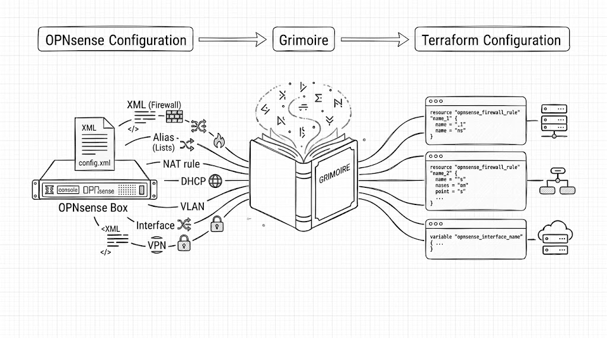

# grimoire



`grimoire` reads a live OPNsense instance via its REST API and generates Terraform/OpenTofu configuration files plus `imports.tf` (native `import` blocks) that bring existing objects into state.

It covers the UUID-based resource types supported by [browningluke/terraform-provider-opnsense](https://github.com/browningluke/terraform-provider-opnsense).

The generated output directory also includes `opnsense.log` with the full API request/response trace.

## Requirements

- Go 1.23+
- [Task](https://taskfile.dev) (for build tasks)
- An OPNsense instance with API access enabled
- OpenTofu 1.6+ or Terraform 1.5+ (for `import` blocks and `task validate`)

## Installation

A prebuilt binary is checked into the repo at `dist/grimoire` (x86-64 Linux) — clone and run it directly, no Go toolchain or build step required:

```sh
git clone https://github.com/vijayanms/grimoire
cd grimoire
./dist/grimoire --uri https://opnsense.example.com --api-key <key> --api-secret <secret> --out-dir ./tf-out
```

On any other platform (macOS, Windows, arm64), or to build off a newer commit than the checked-in binary:

```sh
go install github.com/vijayanms/grimoire/cmd/grimoire@latest
```

Or build from source:

```sh
git clone https://github.com/vijayanms/grimoire
cd grimoire
task build      # or: go build -o dist/grimoire ./cmd/grimoire
```

## For end users

If you have an OPNsense firewall configured by hand and want to bring it under Terraform/OpenTofu management without hand-writing HCL for every alias, rule, and DHCP reservation, this is the workflow:

1. **Enable API access on OPNsense.** System → Access → Users, create (or reuse) a user with API access, then System → Access → API to generate a key/secret pair.

2. **Generate the configuration.**

   ```sh
   grimoire \
     --uri https://opnsense.example.com \
     --api-key <key> \
     --api-secret <secret> \
     --out-dir ./tf-out
   ```

   This queries every supported resource type and writes one `.tf` file per type (only for types that actually have data — empty resource types produce no file), plus `provider.tf`, `variables.tf`, `terraform.tfvars`, and `imports.tf`.

3. **Read the output before trusting it.** Skim the generated `.tf` files. `opnsense.log` in the output directory has the full raw API trace if you need to cross-check a value.

4. **Validate against the provider schema** (catches attribute/type mismatches before you touch state):

   ```sh
   task validate IMPORT_DIR=./tf-out
   ```

5. **Import into state and confirm there's no drift.**

   ```sh
   cd tf-out
   tofu init
   tofu plan    # shows the pending imports (from imports.tf) plus any attribute drift
   tofu apply   # executes the imports — no resources are created, they already exist
   tofu plan    # should show "No changes" if generation was accurate
   ```

   `imports.tf`'s `import` blocks are resolved by `tofu plan`/`apply` through Terraform's normal parallel resource graph, instead of shelling out to `tofu import` once per resource. They're safe to leave in place afterward — once a resource is in state, its `import` block is a no-op on subsequent runs.

   A diff in the last `tofu plan` means the generated HCL doesn't exactly match what the provider itself reads back — treat that as a bug in grimoire's rendering for that resource, not something to work around by hand-editing state.

From here the imported `.tf` files are yours — edit, restructure, split across modules, whatever your Terraform layout normally looks like. Re-running `grimoire` later just regenerates a fresh snapshot; it doesn't touch existing state.

## Usage

```sh
grimoire \
  --uri https://opnsense.example.com \
  --api-key <key> \
  --api-secret <secret> \
  --insecure \
  --out-dir ./tf-out
```

### Environment variables

`--uri`, `--api-key`, `--api-secret` fall back to env vars when unset, so you can skip those flags entirely:

```sh
export OPNSENSE_URI=https://opnsense.example.com
export OPNSENSE_API_KEY=<key>
export OPNSENSE_API_SECRET=<secret>

grimoire --out-dir ./tf-out
```

A flag always wins over its env var. Same names work in `.env` (picked up by `task run`) or `.envrc` (direnv). Extra flags, such as `--insecure`, still work via `CLI_ARGS`:

```sh
task run -- --insecure
```

### Flags

| Flag | Default | Description |
|---|---|---|
| `--uri` | (required) | OPNsense base URI — falls back to `OPNSENSE_URI` |
| `--api-key` | (required) | API key — falls back to `OPNSENSE_API_KEY` |
| `--api-secret` | (required) | API secret — falls back to `OPNSENSE_API_SECRET` |
| `--insecure` | `false` | Skip TLS certificate verification |
| `--out-dir` | `./out` | Output directory |
| `--resources` | (all) | Comma-separated filter, e.g. `opnsense_firewall_alias,opnsense_route` |

### Output

```
<out-dir>/
├── provider.tf              # provider block, credentials via variables
├── variables.tf             # variable declarations for uri/api_key/api_secret
├── terraform.tfvars         # real credential values
├── imports.tf               # native `import` blocks, one per resource
├── opnsense.log             # API request/response trace
├── firewall_alias.tf
├── firewall_filter.tf
├── routes_route.tf
└── ...
```

### Importing state

```sh
cd <out-dir>
tofu init
tofu plan    # shows the pending imports plus any attribute drift
tofu apply   # executes the imports
tofu plan    # should show no changes if generation was accurate
```

## Covered resources

| Resource type | OPNsense module |
|---|---|
| `opnsense_route` | Routes |
| `opnsense_firewall_alias` | Firewall |
| `opnsense_firewall_category` | Firewall |
| `opnsense_firewall_filter` | Firewall |
| `opnsense_firewall_nat` | Firewall |
| `opnsense_firewall_nat_one_to_one` | Firewall |
| `opnsense_firewall_nat_port_forward` | Firewall |
| `opnsense_interfaces_vip` | Interfaces |
| `opnsense_interfaces_vlan` | Interfaces |
| `opnsense_ipsec_connection` | IPsec |
| `opnsense_ipsec_auth_local` | IPsec |
| `opnsense_ipsec_auth_remote` | IPsec |
| `opnsense_ipsec_child` | IPsec |
| `opnsense_ipsec_psk` | IPsec |
| `opnsense_ipsec_vti` | IPsec |
| `opnsense_kea_dhcpv4_subnet` | Kea DHCP |
| `opnsense_kea_dhcpv4_reservation` | Kea DHCP |
| `opnsense_kea_dhcpv4_peer` | Kea DHCP |
| `opnsense_kea_dhcpv6_subnet` | Kea DHCP |
| `opnsense_kea_dhcpv6_reservation` | Kea DHCP |
| `opnsense_kea_dhcpv6_peer` | Kea DHCP |
| `opnsense_kea_dhcpv6_pd_pool` | Kea DHCP |
| `opnsense_dnsmasq_host` | Dnsmasq |
| `opnsense_unbound_domain_override` | Unbound DNS |
| `opnsense_unbound_host_override` | Unbound DNS |
| `opnsense_unbound_host_alias` | Unbound DNS |
| `opnsense_unbound_forward` | Unbound DNS |
| `opnsense_unbound_acl` | Unbound DNS |
| `opnsense_wireguard_server` | WireGuard |
| `opnsense_wireguard_client` | WireGuard |
| `opnsense_quagga_bgp_neighbor` | Quagga BGP |
| `opnsense_quagga_bgp_aspath` | Quagga BGP |
| `opnsense_quagga_bgp_communitylist` | Quagga BGP |
| `opnsense_quagga_bgp_prefixlist` | Quagga BGP |
| `opnsense_quagga_bgp_routemap` | Quagga BGP |
| `opnsense_openvpn_instance` | OpenVPN |
| `opnsense_openvpn_static_key` | OpenVPN |
| `opnsense_openvpn_client_overwrite` | OpenVPN |
| `opnsense_cron_job`¹ | Cron |
| `opnsense_trust_ca` | Trust / PKI |
| `opnsense_trust_cert` | Trust / PKI |

¹ `opnsense_cron_job` exists in [vijayanms/terraform-provider-opnsense](https://github.com/vijayanms/terraform-provider-opnsense) but hasn't been merged into upstream `browningluke/terraform-provider-opnsense` yet — `task validate` will reject it against the published provider until that lands.

Singleton resources without a UUID are not covered because they have no stable import path.

## Development

```sh
task build            # compile
task test             # run unit tests
task lint             # go vet
task fmt              # gofmt
task check            # fmt + lint + test
task update-allowlist # regenerate internal/resources/allowlist_test.go from the provider's GitHub source
task validate         # tofu init + validate generated out/ against the published provider schema
```

`internal/resources/*_test.go` exercise each resource's Fetch function against a fake OPNsense HTTP server (see `internal/resources/testutil_test.go`), so schema/rendering regressions get caught without needing a live firewall. `task validate` is the complementary check — it confirms the generated HCL is actually acceptable to the real, published `terraform-provider-opnsense`, which unit tests alone can't guarantee.

## License

Apache 2.0
